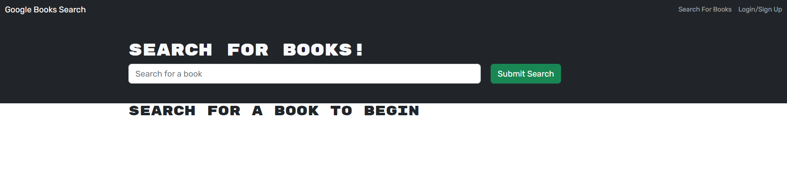
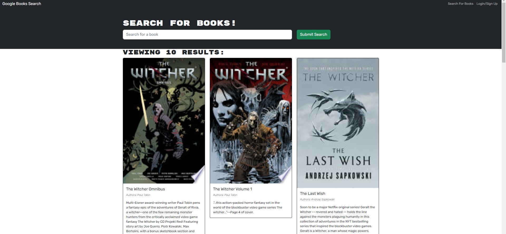
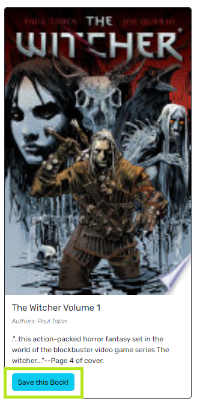
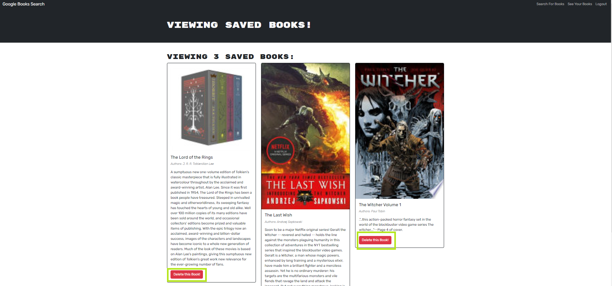

# Book-Search-Engine

## Description

The motivation for this project was to explore building an application using the GraphQL API and an Apollo Server. For this project, I have refactored a fully functioning Book Search Engine built with a RESTful API and rafactored it to be a GraphQL API built with Apollo Server. By building this project, I learned how to configure GraphQL queries and mutations and integrate them with an Apollo server so that they can be used by the frontend client application.

## Table of Contents

- [Installation](#installation)
- [Usage](#usage)
- [License](#license)
- [Contributing](contributing)
- [Questions](#questions)

## Installation

Run the command 'npm i' while in the root project directory. This will install the required serverside and clientside node package modules.  

After installing the required node packages, run 'npm run build' to create the React build directory.

Lastly the command 'npm run develop' will concurrently run both the server and client applications. If running the application locally, the server listens on port 3001, and the client can be accessed on port 3000.

## Usage

To use the application, if you ran 'npm run develop', then the client application should open automatically in your web browser. Otherwise,if running locally, navigate to localhost:3000 in your browser. In the home '/' route, the user is presented with the search engine, along with a link in the nav bar to the login page.

The user is able to use the search bar to enter search terms to the Google Book API. After submitting the search terms, the results are then displayed on the page, and the search bar is subsequently cleared and ready to accept the next search.

A user is able to sign up with a new account or login with an existing account using the 'Login/Sign Up' link in the nav bar. If a user is logged in, then the search results will contain a 'Save this Book!' button at the end of each results entry for saving a book to their saved books list.

If logged in, then the nav bar will also display a 'See Your Books' link, which can be used to access the logged-in user's saved books list. Each entry on this page also contains a 'Delete this Book!' button for removing a book from the list.

## License

n/a

## Contributing

n/a

## Questions

An example run of the application and server is deployed on Heroku at HEROKU LINK HERE.

If you have any questions about the repo, open an issue or contact me directly at ryanfernandez11@gmail.com. You can find more of my work at [my GitHub page](https://github.com/ryanafernandez/).